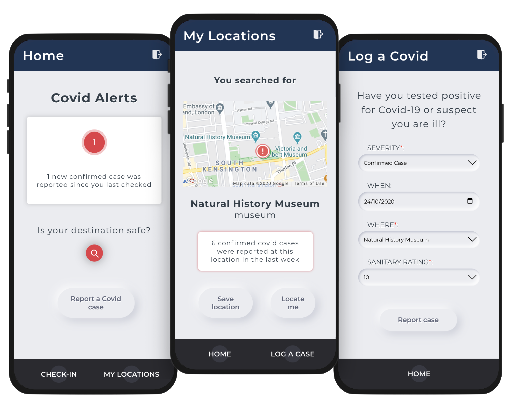

# CompareTheCovid

<p align="center">
  
</p>

Compare the Covid is an intuitive coronavirus contact-tracing and journey-planning app.

Check if a location is safe to travel to, get alerts if you've been exposed to Covid-19 based on the places you've visited.

## Screenshots

<p align="center">
  
</p>

## Getting started

Run the *Compare the Covid* [frontend server](https://github.com/raphael-mazet/compare-the-covid-client)

Create a local .env file in the Prisma directory with:
```
PORT=<yourport>
DB_USERNAME=<yourusername>
DB_PASSWORD=<yourpassword>
DB_HOST=<yourhost>
DATABASE_URL = postgres://${DB_USERNAME}:${DB_PASSWORD}@${DB_HOST}:${DB_PORT}/${DB_NAME}
```

Create an empty database in psql which corresponds to your DB_NAME

In the Prisma folder, run: 
```
psql -h DB_HOST -d DB_NAME -U DB_USER -f schema.sql 
npx prisma introspect 
npx prisma generate 
```

## Built with

* [Apollo Server](https://www.apollographql.com/docs/apollo-server/) - open-source GraphQL server
* [GraphQL](https://graphql.org/) - a query language for APIs
* [Prisma](https://www.prisma.io/) - open-source database toolkit
* [PostgreSQL](https://www.postgresql.org/) - open source relational database
* [JSON Web Tokens](https://jwt.io/) - industry standard authentication method
* [Docker](https://www.docker.com/) - virtualisation service to deliver software in containers

## Authors
[David Hardy](https://github.com/davzhardy), [Filippo Vecchiato](https://github.com/filvecchiato), [Raphaël Mazet](https://github.com/raphael-mazet/)

## Contributing

Improvements and remixes are welcome.
